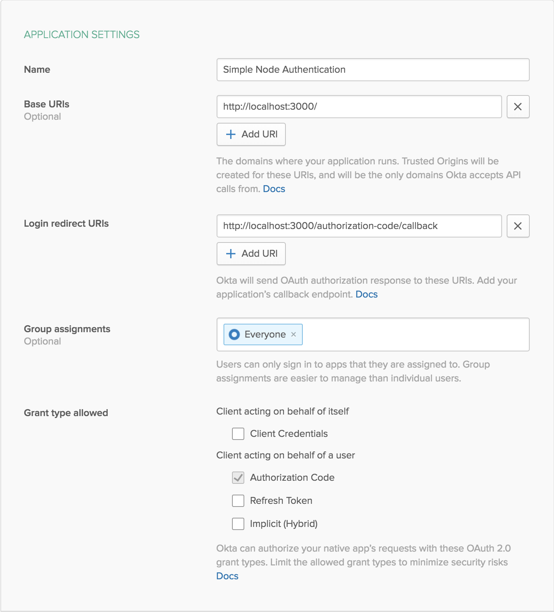

# Node Express Application with Okta Authentication

To install this example application, run the following commands:

```bash
git clone https://github.com/akashgarg04/okta-node-express.git
cd okta-node-express
```

This will get a copy of the project install locally. You will need to set up some environment variables before the app will run properly.

To integrate Okta's Identity Platform for user authentication, you'll first need to:

* [Sign up for a free Okta Developer account](https://www.okta.com/developer/signup/)
* You will get a URL similar to `https://dev-123456.okta.com`.
  * Save this URL for later
  * You will also use this URL to login to your Okta account

You will need to create an application in Okta:

* Log in to your Okta account, then navigate to **Applications** and click the **Add Application** button
* Select **Web** and click **Next**
* Give your application a name (e.g. "Sample Node Auth App")
* Change the **Base URI** to `http://localhost:3000` and the **Login redirect URI** to `http://localhost:3000/authorization-code/callback`, then click **Done**
* Save your **client ID** and **client secret** for later

Your Okta application should have settings similar to the following:



You will also need two API tokens:

* Log in to your Okta account, then navigate to **API > Tokens** and click the **Create Token** button
* Enter a name that will help you remember what this is used for
  * The first one will be for registering users, so a name like "Registration" would work here
  * The second token will be for fetching and editing user profiles, so you could call it something like "User Profiles"
* Save the provided **token value** for later
  * This will only be displayed once. If you lose it, you will need to create another API token
* Repeat this process for the next token

Now create a file called `.env` in the project root and add the following variables, replacing the values with your own from the previous steps.

```bash
HOST_URL=http://localhost:3000
ORG_URL=https://dev-123456.okta.com
CLIENT_ID=okta-application-client-id
CLIENT_SECRET=okta-application-client-secret
REGISTRATION_TOKEN=okta-registration-api-token
USER_PROFILE_TOKEN=okta-user-profile-api-token
APP_SECRET=something-random
```

One way to get a random `APP_SECRET` is to use the following command line, which will generate a random value and add it to your `.env` file.

```bash
echo "APP_SECRET=`openssl rand -base64 32`" >> .env
```

The app also assumes users have `birthdate` and `favoriteColor` custom user attributes. Those need to be added from the Okta Developer Console by going to **Users > Profile Editor**, then click the **Profile** button on the profile labeled **User**. Click **Add Attribute**, then give it a display name like `Birth Date` and a variable name of `birthdate` (case sensitive). Click **Save and Add Another** to add another one with the variable name `favoriteColor`, then click **Save**. The rest of the options can stay at the default.

Activate the environmental variables 

```bash
source .env
```

Now run the application:

```bash
npm install
npm start
```

If you want to run the application in development mode so that any changes you make automatically restart the web server, instead of `npm start` use the command `npm run dev`.

## Links

Here are some links that were helpful in the creation of this example:

* Libraries
  * [Okta OpenID Connect Middleware](https://github.com/okta/okta-oidc-js/tree/master/packages/oidc-middleware)
  * [Okta Node SDK](https://github.com/okta/okta-sdk-nodejs)
  * [Express](https://github.com/expressjs/express)
* Tools
  * [Express Application Generator](https://expressjs.com/en/starter/generator.html)
* Blogs
  * [Build User Registration with Node, React, and Okta](https://developer.okta.com/blog/2018/02/06/build-user-registration-with-node-react-and-okta)
  * [Build a Basic CRUD App with Vue.js and Node](https://developer.okta.com/blog/2018/02/15/build-crud-app-vuejs-node)

